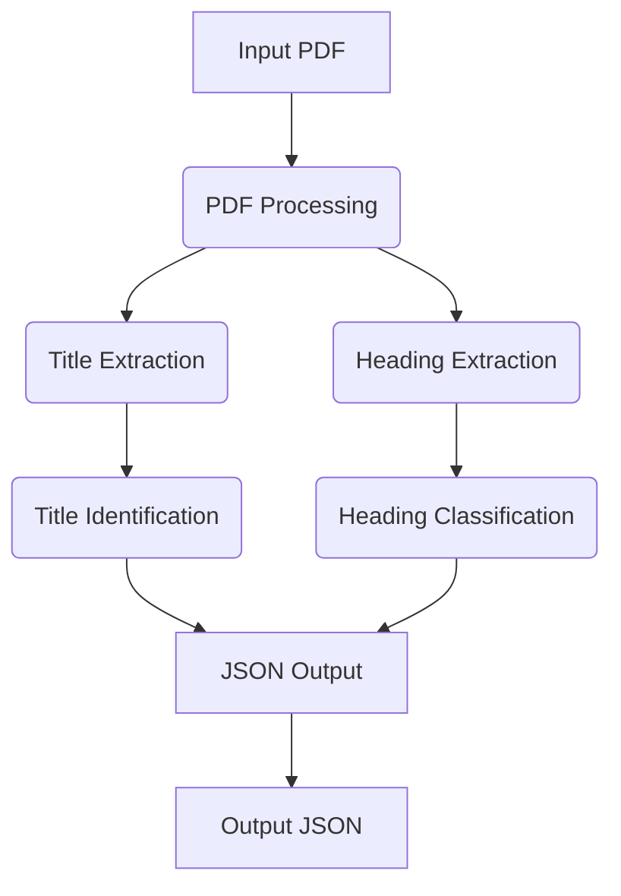

# PDF Outline Extractor (Challenge 1A)

This tool extracts the document structure (Title, H1, H2, H3) from PDF files and outputs a JSON outline per PDF.

[](https://hub.docker.com/r/rohitk1603/pdf-outline-extractor)


## Features
- Automatic detection of document title and hierarchical headings (H1, H2, H3)
- Page number annotation for each heading
- Robust font‑size–based level inference with adjustable thresholds
- Pure Python implementation (no ML models) for minimal footprint
- Offline operation with no internet dependencies

## System Requirements
- **CPU Architecture:** AMD64 (x86_64)
- **Operating System:** Linux, macOS, or Windows with Docker/Python support
- **Docker:** 20.10+ (for containerized run)
- **Python:** 3.10
- **RAM:** ≥ 4 GB (8 GB recommended for large PDFs)
- **Disk:** ≥ 100 MB free

# Solution Architecture



## Quick Start
### Using Docker
```bash
# Pull the image
docker pull rohitk1603/pdf-outline-extractor:latest

# Run with mounted data directory
docker run --rm -v ${PWD}\input:/app/input:ro -v ${PWD}\output:/app/output --network none pdf-outline-extractor:latest

```

# Sample Input/Output for testing

## Sample Input & Output

- **Sample PDF Preview**
📄 [file01.pdf](input/file01.pdf)

## Output in json format
```bash
{
  "title": "Application form for grant of LTC advance",
  "outline": [
    {
      "level": "H1",
      "text": "Application form for grant of LTC advance",
      "page": 0
    },
    {
      "level": "H2",
      "text": "1.",
      "page": 0
    },
    {
      "level": "H2",
      "text": "Name of the Government Servant",
      "page": 0
    },
    {
      "level": "H2",
      "text": "2.",
      "page": 0
    },
    {
      "level": "H2",
      "text": "Designation",
      "page": 0
    },
    {
      "level": "H2",
      "text": "3.",
      "page": 0
    },
    {
      "level": "H2",
      "text": "Date of entering the Central Government",
      "page": 0
    },
    {
      "level": "H2",
      "text": "Service",
      "page": 0
    },
    {
      "level": "H2",
      "text": "4.",
      "page": 0
    },
    {
      "level": "H2",
      "text": "PAY + SI + NPA",
      "page": 0
    },
    {
      "level": "H2",
      "text": "5.",
      "page": 0
    },
    {
      "level": "H2",
      "text": "Whether permanent or temporary",
      "page": 0
    },
    {
      "level": "H2",
      "text": "6.",
      "page": 0
    },
    {
      "level": "H2",
      "text": "Home Town as recorded in the Service Book",
      "page": 0
    },
    {
      "level": "H2",
      "text": "7.",
      "page": 0
    },
    {
      "level": "H2",
      "text": "Whether wife / husband is employed and if",
      "page": 0
    },
    {
      "level": "H2",
      "text": "so whether entitled to LTC",
      "page": 0
    },
    {
      "level": "H2",
      "text": "8.",
      "page": 0
    },
    {
      "level": "H2",
      "text": "Whether the concession is to be availed for",
      "page": 0
    },
    {
      "level": "H2",
      "text": "visiting home town and if so block for which",
      "page": 0
    },
    {
      "level": "H2",
      "text": "LTC is to be availed.",
      "page": 0
    },
    {
      "level": "H2",
      "text": "9.",
      "page": 0
    },
    {
      "level": "H2",
      "text": "(a) If the concession is to visit anywhere in",
      "page": 0
    },
    {
      "level": "H2",
      "text": "India, the place to be visited.",
      "page": 0
    },
    {
      "level": "H2",
      "text": "(b) Block for which to be availed.",
      "page": 0
    },
    {
      "level": "H2",
      "text": "10.",
      "page": 0
    },
    {
      "level": "H2",
      "text": "Single",
      "page": 0
    },
    {
      "level": "H2",
      "text": "rail",
      "page": 0
    },
    {
      "level": "H2",
      "text": "fare/bus",
      "page": 0
    },
    {
      "level": "H2",
      "text": "fare",
      "page": 0
    },
    {
      "level": "H2",
      "text": "from",
      "page": 0
    },
    {
      "level": "H2",
      "text": "the",
      "page": 0
    },
    {
      "level": "H2",
      "text": "headquarters to home town/place of visit by",
      "page": 0
    },
    {
      "level": "H2",
      "text": "shortest route.",
      "page": 0
    },
    {
      "level": "H2",
      "text": "11.",
      "page": 0
    },
    {
      "level": "H2",
      "text": "Persons in respect of whom LTC is proposed to be availed.",
      "page": 0
    },
    {
      "level": "H2",
      "text": "S.No",
      "page": 0
    },
    {
      "level": "H2",
      "text": "Name",
      "page": 0
    },
    {
      "level": "H2",
      "text": "Age",
      "page": 0
    },
    {
      "level": "H2",
      "text": "Relationship",
      "page": 0
    },
    {
      "level": "H2",
      "text": "1.",
      "page": 0
    },
    {
      "level": "H2",
      "text": "2.",
      "page": 0
    },
    {
      "level": "H2",
      "text": "3.",
      "page": 0
    },
    {
      "level": "H2",
      "text": "4.",
      "page": 0
    },
    {
      "level": "H2",
      "text": "5.",
      "page": 0
    },
    {
      "level": "H2",
      "text": "6.",
      "page": 0
    },
    {
      "level": "H2",
      "text": "12.",
      "page": 0
    },
    {
      "level": "H2",
      "text": "Amount of advance required.",
      "page": 0
    },
    {
      "level": "H2",
      "text": "Rs.",
      "page": 0
    },
    {
      "level": "H2",
      "text": "I declare that the particulars furnished above are true and correct to the best of my knowledge.  I",
      "page": 0
    },
    {
      "level": "H2",
      "text": "undertake to produce the tickets for the outward journey within ten days of receipt of the advance.",
      "page": 0
    },
    {
      "level": "H2",
      "text": "In the event of cancellation of the journey or if I fail to produce the tickets within ten days of receipt of",
      "page": 0
    },
    {
      "level": "H2",
      "text": "advance, I undertake to refund the entire advance in one lump sum.",
      "page": 0
    },
    {
      "level": "H2",
      "text": "Date",
      "page": 0
    },
    {
      "level": "H2",
      "text": "Signature of Government Servant.",
      "page": 0
    }
  ]
}
```
# Repository Structure
```bash
round1a_outline_extractor/
├── Dockerfile
├── README.md
├── requirements.txt
├── process_pdfs.py
├── input/              # Place PDFs here for Python run
└── output/             # JSON outputs appear here
```
```bash
Compliance with Competition Requirements
Execution Time: < 10 s for 50‑page PDFs (tested on 8 CPUs, 16 GB RAM)

Model Size: No external models (pure code) < 5 MB

Network: Runs with --network none (offline)

Runtime: CPU‑only, AMD64‑compatible

Output Schema: Matches the provided JSON spec
```

# ✨ Credits
```bash
Team [Trinity Devs] — Adobe India Hackathon 2025 Submission.
```
